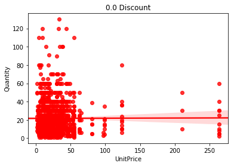
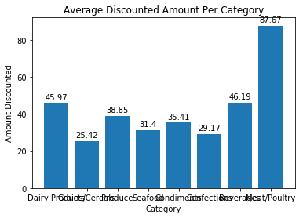

# <center> Module 2 Project  - Northwind Database Hypothesis Testing

## <center>Matthew Sparr <br><br> <center><h8>Self-Paced Data Science Program

# <center> Introduction

#### <center> In this project we will be working with the Northwind Database. This is a sample database provided by Microsoft which contains sales data for a ficticious specialty foods company. We will be posing several questions for which we will develop and test hypotheses in effort to present important information for the company.

First we will import all the necessary libraries.


```python
import sqlite3 as sql
import pandas as pd
import numpy as np
from sklearn.linear_model import LinearRegression
from sklearn.preprocessing import MinMaxScaler
from sklearn.linear_model import Lasso, Ridge, LinearRegression
from sklearn.model_selection import train_test_split
import matplotlib.pyplot as plt
from sklearn.linear_model import LinearRegression
from sklearn.model_selection import cross_val_score
from sklearn.model_selection import KFold
from sklearn import preprocessing
import statsmodels.api as sm
from statsmodels.formula.api import ols
import seaborn as sns
from scipy import stats
from sklearn import linear_model as lm
from statsmodels.graphics.factorplots import interaction_plot
from statsmodels.stats.multicomp import pairwise_tukeyhsd
from statsmodels.stats.multicomp import MultiComparison
```

Next we will connect to the database and grab all the table names.


```python
conn = sql.connect('Northwind_small.sqlite')
cur = conn.cursor()
table_names = list(cur.execute('''SELECT name FROM sqlite_master WHERE TYPE = 'table'
                               ''').fetchall())
table_names
```


    [('Employee',),
     ('Category',),
     ('Customer',),
     ('Shipper',),
     ('Supplier',),
     ('Order',),
     ('Product',),
     ('OrderDetail',),
     ('CustomerCustomerDemo',),
     ('CustomerDemographic',),
     ('Region',),
     ('Territory',),
     ('EmployeeTerritory',)]


Now we will store each table from the database as Pandas Dataframe so that they are easy to work with and analyze. There was a technical error with the 'orders' table, so a CSV file of the table was generated using an outside program.


```python
sql_comm = []
for i in range(0,len(table_names)):
    s = "SELECT * FROM " + table_names[i][0]
    sql_comm.append(s)

employees = pd.read_sql_query(sql_comm[0], conn)
categories = pd.read_sql_query(sql_comm[1], conn)
customers = pd.read_sql_query(sql_comm[2], conn)
shippers = pd.read_sql_query(sql_comm[3], conn)

suppliers = pd.read_sql_query(sql_comm[4], conn)
products = pd.read_sql_query(sql_comm[6], conn)
order_details = pd.read_sql_query(sql_comm[7], conn)
orders = pd.read_csv('Order.csv')

cust_cust_demos = pd.read_sql_query(sql_comm[8], conn)
cust_demos = pd.read_sql_query(sql_comm[9], conn)
regions = pd.read_sql_query(sql_comm[10], conn)
territories = pd.read_sql_query(sql_comm[11], conn)
emp_territories = pd.read_sql_query(sql_comm[12], conn)
```

And here is a schema of the database.


## Q1 -- Does discount amount have a statistically significant effect on the quantity of a product in an order? If so, at what level(s) of discount?

## <center>H<sub>0: The average quantity of product ordered is the same for orders with and without a discount.

## <center>H<sub>a: The average quantity of product ordered when a discount is given is higher or lower than for orders without a discount.

The above is our first question and both the null and alternative hypotheses. To test them will involve a two-tail test. This is because if the null hypothesis is rejected and there is a correlation between discount and order quantity, we could find that the discount amount either increases or decreases the quantity of product ordered. 

To test our hypotheses we will be using the table 'order_details' and will be looking only at the columns 'Quantity' and 'Discount'. Below we can see that there are no null or missing values in either column. Also, 'Quantity' ranges from 1 to 130 and 'Discount' ranges from 0 to 0.25.


```python
order_details[['Quantity','Discount']].info()
```

    <class 'pandas.core.frame.DataFrame'>
    RangeIndex: 2155 entries, 0 to 2154
    Data columns (total 2 columns):
    Quantity    2155 non-null int64
    Discount    2155 non-null float64
    dtypes: float64(1), int64(1)
    memory usage: 33.8 KB
    


```python
order_details[['Quantity','Discount']].describe()
```


<div>
<style scoped>
    .dataframe tbody tr th:only-of-type {
        vertical-align: middle;
    }

    .dataframe tbody tr th {
        vertical-align: top;
    }

    .dataframe thead th {
        text-align: right;
    }
</style>
<table border="1" class="dataframe">
  <thead>
    <tr style="text-align: right;">
      <th></th>
      <th>Quantity</th>
      <th>Discount</th>
    </tr>
  </thead>
  <tbody>
    <tr>
      <th>count</th>
      <td>2155.000000</td>
      <td>2155.000000</td>
    </tr>
    <tr>
      <th>mean</th>
      <td>23.812993</td>
      <td>0.056167</td>
    </tr>
    <tr>
      <th>std</th>
      <td>19.022047</td>
      <td>0.083450</td>
    </tr>
    <tr>
      <th>min</th>
      <td>1.000000</td>
      <td>0.000000</td>
    </tr>
    <tr>
      <th>25%</th>
      <td>10.000000</td>
      <td>0.000000</td>
    </tr>
    <tr>
      <th>50%</th>
      <td>20.000000</td>
      <td>0.000000</td>
    </tr>
    <tr>
      <th>75%</th>
      <td>30.000000</td>
      <td>0.100000</td>
    </tr>
    <tr>
      <th>max</th>
      <td>130.000000</td>
      <td>0.250000</td>
    </tr>
  </tbody>
</table>
</div>


```python
order_details['Discount_bin'] = order_details['Discount'].apply(lambda x: 1 if x > 0 else 0)
```


```python
X = ['Discount', 'No Discount']
y = [order_details['Quantity'][order_details['Discount_bin'] == 1].mean(),
     order_details['Quantity'][order_details['Discount_bin'] == 0].mean()]
plt.bar(X,y, color=('navy','grey'))
plt.text(s=round(y[1],2), x=1, y=10, color="w", horizontalalignment='center',size=18)
plt.text(s=round(y[0],2), x=0, y=10, color="w", horizontalalignment='center',size=18)
plt.ylabel('Average Quantity')
plt.title('Discount v.s. No Discount Average Quantity of Product Per Order')
```


    Text(0.5,1,'Discount v.s. No Discount Average Quantity of Product Per Order')


Now we will split our order details into two sets: discount and no discount. Running a t-test on the data below then gives us a small p-value of 1.14e-10 which is less than our alpha of 0.05.


```python
no_disc = order_details[order_details['Discount'] == 0].copy()
disc = order_details[order_details['Discount'] > 0].copy()

p = stats.ttest_ind(no_disc.Quantity, disc.Quantity)[1]
p
```


    1.1440924523215966e-10


Since the p-value for our t-test is so low, this allows us to reject the null-hypothesis and accept instead the alternative hypothesis. From this result we can reasonably argue that having a discount does indeed have an impact on the quantity of product ordered. 

For the second part of the question we will need to look at the different discount amounts and see where the size of the discount affects the quantity ordered the most. Let's start by creating a dataframe with only orders with a 'Discount' and then viewing the value counts.


```python
q1_data = order_details[order_details['Discount'] > 0]
```


```python
q1_data.Discount.value_counts()
```


    0.05    185
    0.10    173
    0.20    161
    0.15    157
    0.25    154
    0.03      3
    0.02      2
    0.04      1
    0.06      1
    0.01      1
    Name: Discount, dtype: int64


Since the count of some 'Discount' values are so few compared to others, we will group those discount values together. By adjusting those values of 'Discount' (0.01, 0.02, 0.03, 0.04, and 0.06) to 0.05, we will have 5 buckets with similar value counts.


```python
q1_data['Discount'] = q1_data['Discount'].apply(lambda x: 0.05 if (x > 0) & (x < 0.10) else x)
q1_data['Discount'].value_counts()
```

    C:\Users\sparr\Anaconda3\lib\site-packages\ipykernel_launcher.py:1: SettingWithCopyWarning: 
    A value is trying to be set on a copy of a slice from a DataFrame.
    Try using .loc[row_indexer,col_indexer] = value instead
    
    See the caveats in the documentation: http://pandas.pydata.org/pandas-docs/stable/indexing.html#indexing-view-versus-copy
      """Entry point for launching an IPython kernel.
    


    0.05    193
    0.10    173
    0.20    161
    0.15    157
    0.25    154
    Name: Discount, dtype: int64


For this second part of the question, we will need another null and alternative hypothesis.

## <center>H<sub>0: The average quantity of product ordered is the same for each discount level.

## <center>H<sub>a: The average quantity of product ordered differs across the discount levels.

Since we want to test for difference of mean, we can use an analysis of variance or one-way ANOVA test to resolve our hypotheses. Since we have 5 distinct 'Discount' values we will run this ANOVA with 'Discount' as a categorical variable.


```python
X = []
y = []
for i in q1_data['Discount'].unique():
    X.append(i)
    y.append(q1_data['Quantity'][q1_data['Discount'] == i].mean())
ax = plt.bar(X,y,width=.03)
plt.ylim(0,32)
plt.ylabel('Average Quantity')
plt.xlabel('Discount')
plt.title('Discount Level v.s. Average Quantity of Product Per Order')
rects = ax.patches
y_round = []
for i in y:
    y_round.append(round(i,2))
labels = y_round
for rect, label in zip(rects, labels):
    height = rect.get_height()
    plt.text(rect.get_x() + rect.get_width() / 2, height + 1, label,
            ha='center', va='bottom')
```


```python
formula = 'Quantity ~ C(Discount)'
lm = ols(formula, q1_data).fit()
table = sm.stats.anova_lm(lm, typ=1)
table
```


<div>
<style scoped>
    .dataframe tbody tr th:only-of-type {
        vertical-align: middle;
    }

    .dataframe tbody tr th {
        vertical-align: top;
    }

    .dataframe thead th {
        text-align: right;
    }
</style>
<table border="1" class="dataframe">
  <thead>
    <tr style="text-align: right;">
      <th></th>
      <th>df</th>
      <th>sum_sq</th>
      <th>mean_sq</th>
      <th>F</th>
      <th>PR(&gt;F)</th>
    </tr>
  </thead>
  <tbody>
    <tr>
      <th>C(Discount)</th>
      <td>4.0</td>
      <td>1065.701253</td>
      <td>266.425313</td>
      <td>0.616376</td>
      <td>0.650947</td>
    </tr>
    <tr>
      <th>Residual</th>
      <td>833.0</td>
      <td>360060.198508</td>
      <td>432.245136</td>
      <td>NaN</td>
      <td>NaN</td>
    </tr>
  </tbody>
</table>
</div>


The p-value of our categorical 'Discount' variable is ~0.651 as shown in the above table. Since this value is much higher than our alpha of 0.05, we fail to reject the null hypothesis. This suggests that the average quantities of product ordered across the discount levels are not significantly different.

### Our findings show that having a discount on a product most likely will increase the quantity of product order but the actual amount of discount is statistically insignificant. 

## Q2 -- Are there certain products that are better to discount than others in order to increase the quantity ordered?

As a follow-up to our initial question, we will investigate whether or not the category of product intereacts with whether or not a discount is applied in regards to quantity of product ordered.

## <center>H<sub>0: There is no interaction between category of product and whether or not a discount is applied.

## <center>H<sub>a: There is some interaction between category of product and whether or not a discount is applied.

To test our hypothesis we will need data from more than one table so we will need to perform a couple merges. We will first join the 'products' table to the 'order-details' table as 'prod_ord_details'; and then merge that table with the 'categories' table.


```python
prod_ord_details = pd.merge(products, 
                  order_details,
                  left_on='Id',
                  right_on='ProductId',
                  how='left')
prod_cat = pd.merge(prod_ord_details, 
                  categories,
                  left_on='CategoryId',
                  right_on='Id',
                  how='left')
prod_cat.head()
```


<div>
<style scoped>
    .dataframe tbody tr th:only-of-type {
        vertical-align: middle;
    }

    .dataframe tbody tr th {
        vertical-align: top;
    }

    .dataframe thead th {
        text-align: right;
    }
</style>
<table border="1" class="dataframe">
  <thead>
    <tr style="text-align: right;">
      <th></th>
      <th>Id_x</th>
      <th>ProductName</th>
      <th>SupplierId</th>
      <th>CategoryId</th>
      <th>QuantityPerUnit</th>
      <th>UnitPrice_x</th>
      <th>UnitsInStock</th>
      <th>UnitsOnOrder</th>
      <th>ReorderLevel</th>
      <th>Discontinued</th>
      <th>Id_y</th>
      <th>OrderId</th>
      <th>ProductId</th>
      <th>UnitPrice_y</th>
      <th>Quantity</th>
      <th>Discount</th>
      <th>Discount_bin</th>
      <th>Id</th>
      <th>CategoryName</th>
      <th>Description</th>
    </tr>
  </thead>
  <tbody>
    <tr>
      <th>0</th>
      <td>1</td>
      <td>Chai</td>
      <td>1</td>
      <td>1</td>
      <td>10 boxes x 20 bags</td>
      <td>18.0</td>
      <td>39</td>
      <td>0</td>
      <td>10</td>
      <td>0</td>
      <td>10285/1</td>
      <td>10285</td>
      <td>1</td>
      <td>14.4</td>
      <td>45</td>
      <td>0.20</td>
      <td>1</td>
      <td>1</td>
      <td>Beverages</td>
      <td>Soft drinks, coffees, teas, beers, and ales</td>
    </tr>
    <tr>
      <th>1</th>
      <td>1</td>
      <td>Chai</td>
      <td>1</td>
      <td>1</td>
      <td>10 boxes x 20 bags</td>
      <td>18.0</td>
      <td>39</td>
      <td>0</td>
      <td>10</td>
      <td>0</td>
      <td>10294/1</td>
      <td>10294</td>
      <td>1</td>
      <td>14.4</td>
      <td>18</td>
      <td>0.00</td>
      <td>0</td>
      <td>1</td>
      <td>Beverages</td>
      <td>Soft drinks, coffees, teas, beers, and ales</td>
    </tr>
    <tr>
      <th>2</th>
      <td>1</td>
      <td>Chai</td>
      <td>1</td>
      <td>1</td>
      <td>10 boxes x 20 bags</td>
      <td>18.0</td>
      <td>39</td>
      <td>0</td>
      <td>10</td>
      <td>0</td>
      <td>10317/1</td>
      <td>10317</td>
      <td>1</td>
      <td>14.4</td>
      <td>20</td>
      <td>0.00</td>
      <td>0</td>
      <td>1</td>
      <td>Beverages</td>
      <td>Soft drinks, coffees, teas, beers, and ales</td>
    </tr>
    <tr>
      <th>3</th>
      <td>1</td>
      <td>Chai</td>
      <td>1</td>
      <td>1</td>
      <td>10 boxes x 20 bags</td>
      <td>18.0</td>
      <td>39</td>
      <td>0</td>
      <td>10</td>
      <td>0</td>
      <td>10348/1</td>
      <td>10348</td>
      <td>1</td>
      <td>14.4</td>
      <td>15</td>
      <td>0.15</td>
      <td>1</td>
      <td>1</td>
      <td>Beverages</td>
      <td>Soft drinks, coffees, teas, beers, and ales</td>
    </tr>
    <tr>
      <th>4</th>
      <td>1</td>
      <td>Chai</td>
      <td>1</td>
      <td>1</td>
      <td>10 boxes x 20 bags</td>
      <td>18.0</td>
      <td>39</td>
      <td>0</td>
      <td>10</td>
      <td>0</td>
      <td>10354/1</td>
      <td>10354</td>
      <td>1</td>
      <td>14.4</td>
      <td>12</td>
      <td>0.00</td>
      <td>0</td>
      <td>1</td>
      <td>Beverages</td>
      <td>Soft drinks, coffees, teas, beers, and ales</td>
    </tr>
  </tbody>
</table>
</div>


Viewing the head of the merged table we can see lots of variables we don't need. We will create a new DataFrame with only the categories we need: 'Quantity', 'Discount', and 'CategoryName'.


```python
q2_data = prod_cat[['Quantity', 'Discount', 'CategoryName']]
q2_data.head()
```


<div>
<style scoped>
    .dataframe tbody tr th:only-of-type {
        vertical-align: middle;
    }

    .dataframe tbody tr th {
        vertical-align: top;
    }

    .dataframe thead th {
        text-align: right;
    }
</style>
<table border="1" class="dataframe">
  <thead>
    <tr style="text-align: right;">
      <th></th>
      <th>Quantity</th>
      <th>Discount</th>
      <th>CategoryName</th>
    </tr>
  </thead>
  <tbody>
    <tr>
      <th>0</th>
      <td>45</td>
      <td>0.20</td>
      <td>Beverages</td>
    </tr>
    <tr>
      <th>1</th>
      <td>18</td>
      <td>0.00</td>
      <td>Beverages</td>
    </tr>
    <tr>
      <th>2</th>
      <td>20</td>
      <td>0.00</td>
      <td>Beverages</td>
    </tr>
    <tr>
      <th>3</th>
      <td>15</td>
      <td>0.15</td>
      <td>Beverages</td>
    </tr>
    <tr>
      <th>4</th>
      <td>12</td>
      <td>0.00</td>
      <td>Beverages</td>
    </tr>
  </tbody>
</table>
</div>


Since we are concerned with the interaction between category and whether or not a discount is applied, we will need to modify our 'Discount' column to make it binary. We will do this by making all values of discount greater than zero equal to 1 and leaving no discount instances as 0.


```python
q2_data['Discount'] = q2_data['Discount'].apply(lambda x: 1 if x > 0 else 0)
```

    C:\Users\sparr\Anaconda3\lib\site-packages\ipykernel_launcher.py:1: SettingWithCopyWarning: 
    A value is trying to be set on a copy of a slice from a DataFrame.
    Try using .loc[row_indexer,col_indexer] = value instead
    
    See the caveats in the documentation: http://pandas.pydata.org/pandas-docs/stable/indexing.html#indexing-view-versus-copy
      """Entry point for launching an IPython kernel.
    

Since we want to test the impact of a variable ('Discount') on the dependent variable ('Quantity') for multiple groups ('CategoryName'), we will use analysis of variance or ANOVA to test our hypothesis. 


```python
formula = 'Quantity ~ C(CategoryName)*C(Discount)'
lm = ols(formula, q2_data).fit()
table = sm.stats.anova_lm(lm, typ=2)
table
```


<div>
<style scoped>
    .dataframe tbody tr th:only-of-type {
        vertical-align: middle;
    }

    .dataframe tbody tr th {
        vertical-align: top;
    }

    .dataframe thead th {
        text-align: right;
    }
</style>
<table border="1" class="dataframe">
  <thead>
    <tr style="text-align: right;">
      <th></th>
      <th>sum_sq</th>
      <th>df</th>
      <th>F</th>
      <th>PR(&gt;F)</th>
    </tr>
  </thead>
  <tbody>
    <tr>
      <th>C(CategoryName)</th>
      <td>1118.470015</td>
      <td>7.0</td>
      <td>0.449689</td>
      <td>8.708672e-01</td>
    </tr>
    <tr>
      <th>C(Discount)</th>
      <td>14729.606130</td>
      <td>1.0</td>
      <td>41.454988</td>
      <td>1.484744e-10</td>
    </tr>
    <tr>
      <th>C(CategoryName):C(Discount)</th>
      <td>3357.463105</td>
      <td>7.0</td>
      <td>1.349892</td>
      <td>2.226259e-01</td>
    </tr>
    <tr>
      <th>Residual</th>
      <td>760020.189876</td>
      <td>2139.0</td>
      <td>NaN</td>
      <td>NaN</td>
    </tr>
  </tbody>
</table>
</div>


From the above table we can see that the interaction of 'CategoryName' and 'Discount' has a p-value of ~0.223. Since this is less than our alpha of 0.05, we fail to reject the null hypothesis. From these results, it appears there is no significant difference in quantity of product ordered across the different combinations of category and whether or not a discount is applied. 

We can also view an interaction plot of our variables to show this lack of interaction.


```python
plt.figure(figsize=(12,10))
fig = interaction_plot(q2_data['Discount'],q2_data['CategoryName'],q2_data['Quantity'], ms=10, ax=plt.gca())
plt.xticks(np.arange(0,1.5,step=1), ('No Discount', 'Discount'))
plt.xlabel('')
```


    Text(0.5,0,'')


We can see from the above graph that the lines for each of the category are mostly parallel with each other which implies little to no interaction with the other independent variable 'Discount'. The categories of 'Confections' and 'Grains/Cereals' do have slightly different slopes than the other categories but according to our ANOVA results, this difference is not significant.

### Our findings signify that there is not sufficient evidence that certain categories benefit more than others from having a discount applied versus not providing a discount. There may be some slight differences between certain categories but the differences overall are not statistically significant.

 

## Q3 -- Is there an optimal discount level based on the price of the product?

For this question we are wondering whether or not there is an interaction between 'Discount' and 'UnitPrice'. From this we can learn whether a certain discount level can lead to a higher 'Quantity' of product ordered depending on the product's price.

## <center>H<sub>0: There is no interaction between the discount level and unit price in regards to quantity.

## <center>H<sub>a: There is some interaction between discount level and unit price in regards to quantity.

To answer this question we will first need to create a relevant data table. Since we are only concerned with 'UnitPrice', 'Discount' and 'Quantity', we can simply grab those from the 'order_details' table.


```python
q3_data = order_details[['UnitPrice', 'Discount', 'Quantity']].copy()
```

From the first question, we know that there are a couple 'Discount' values with few instances.


```python
q3_data['Discount'].value_counts()
```


    0.00    1317
    0.05     185
    0.10     173
    0.20     161
    0.15     157
    0.25     154
    0.03       3
    0.02       2
    0.01       1
    0.04       1
    0.06       1
    Name: Discount, dtype: int64


Since the values with low value counts are all close to 0.05, we will modify those few 'Discount' levels and set them equal to 0.05.


```python
q3_data['Discount'] = q3_data['Discount'].apply(lambda x: 0.05 if (x > 0) & (x < 0.10) else x)
```


```python
q3_data['Discount'].value_counts()
```


    0.00    1317
    0.05     193
    0.10     173
    0.20     161
    0.15     157
    0.25     154
    Name: Discount, dtype: int64


```python
colors = ['red','blue','green','yellow','purple','orange']
discounts = q3_data['Discount'].unique()
for i in range(0,len(discounts)):
    data = q3_data[q3_data['Discount'] == discounts[i]]
    c=np.random.rand(3,1)
    sns.regplot(data['UnitPrice'],data['Quantity'],color=colors[i])
    plt.title(str(discounts[i]) + ' Discount')
    plt.show()

```

    C:\Users\sparr\Anaconda3\lib\site-packages\scipy\stats\stats.py:1713: FutureWarning: Using a non-tuple sequence for multidimensional indexing is deprecated; use `arr[tuple(seq)]` instead of `arr[seq]`. In the future this will be interpreted as an array index, `arr[np.array(seq)]`, which will result either in an error or a different result.
      return np.add.reduce(sorted[indexer] * weights, axis=axis) / sumval
    





Since we are looking to analyze the interaction between a categorical variable 'Discount' and a continuous variable 'UnitPrice' we will use analysis of covariance or ANCOVA to answer our hypothesis.


```python
formula = 'Quantity ~ C(Discount)*UnitPrice'
lm = ols(formula, q3_data).fit()
lm.summary()
```


<table class="simpletable">
<caption>OLS Regression Results</caption>
<tr>
  <th>Dep. Variable:</th>        <td>Quantity</td>     <th>  R-squared:         </th> <td>   0.023</td> 
</tr>
<tr>
  <th>Model:</th>                   <td>OLS</td>       <th>  Adj. R-squared:    </th> <td>   0.018</td> 
</tr>
<tr>
  <th>Method:</th>             <td>Least Squares</td>  <th>  F-statistic:       </th> <td>   4.592</td> 
</tr>
<tr>
  <th>Date:</th>             <td>Mon, 03 Dec 2018</td> <th>  Prob (F-statistic):</th> <td>6.18e-07</td> 
</tr>
<tr>
  <th>Time:</th>                 <td>14:58:14</td>     <th>  Log-Likelihood:    </th> <td> -9380.0</td> 
</tr>
<tr>
  <th>No. Observations:</th>      <td>  2155</td>      <th>  AIC:               </th> <td>1.878e+04</td>
</tr>
<tr>
  <th>Df Residuals:</th>          <td>  2143</td>      <th>  BIC:               </th> <td>1.885e+04</td>
</tr>
<tr>
  <th>Df Model:</th>              <td>    11</td>      <th>                     </th>     <td> </td>    
</tr>
<tr>
  <th>Covariance Type:</th>      <td>nonrobust</td>    <th>                     </th>     <td> </td>    
</tr>
</table>
<table class="simpletable">
<tr>
                <td></td>                   <th>coef</th>     <th>std err</th>      <th>t</th>      <th>P>|t|</th>  <th>[0.025</th>    <th>0.975]</th>  
</tr>
<tr>
  <th>Intercept</th>                     <td>   21.6653</td> <td>    0.692</td> <td>   31.297</td> <td> 0.000</td> <td>   20.308</td> <td>   23.023</td>
</tr>
<tr>
  <th>C(Discount)[T.0.05]</th>           <td>    5.6568</td> <td>    1.839</td> <td>    3.076</td> <td> 0.002</td> <td>    2.051</td> <td>    9.263</td>
</tr>
<tr>
  <th>C(Discount)[T.0.1]</th>            <td>    4.8518</td> <td>    1.981</td> <td>    2.449</td> <td> 0.014</td> <td>    0.967</td> <td>    8.736</td>
</tr>
<tr>
  <th>C(Discount)[T.0.15]</th>           <td>    6.3929</td> <td>    2.720</td> <td>    2.350</td> <td> 0.019</td> <td>    1.058</td> <td>   11.728</td>
</tr>
<tr>
  <th>C(Discount)[T.0.2]</th>            <td>    3.2313</td> <td>    2.154</td> <td>    1.500</td> <td> 0.134</td> <td>   -0.992</td> <td>    7.455</td>
</tr>
<tr>
  <th>C(Discount)[T.0.25]</th>           <td>    4.5212</td> <td>    2.241</td> <td>    2.018</td> <td> 0.044</td> <td>    0.127</td> <td>    8.916</td>
</tr>
<tr>
  <th>UnitPrice</th>                     <td>    0.0019</td> <td>    0.017</td> <td>    0.109</td> <td> 0.913</td> <td>   -0.032</td> <td>    0.036</td>
</tr>
<tr>
  <th>C(Discount)[T.0.05]:UnitPrice</th> <td>   -0.0149</td> <td>    0.038</td> <td>   -0.395</td> <td> 0.693</td> <td>   -0.089</td> <td>    0.059</td>
</tr>
<tr>
  <th>C(Discount)[T.0.1]:UnitPrice</th>  <td>   -0.0528</td> <td>    0.050</td> <td>   -1.055</td> <td> 0.291</td> <td>   -0.151</td> <td>    0.045</td>
</tr>
<tr>
  <th>C(Discount)[T.0.15]:UnitPrice</th> <td>    0.0122</td> <td>    0.096</td> <td>    0.128</td> <td> 0.898</td> <td>   -0.175</td> <td>    0.200</td>
</tr>
<tr>
  <th>C(Discount)[T.0.2]:UnitPrice</th>  <td>    0.0886</td> <td>    0.062</td> <td>    1.430</td> <td> 0.153</td> <td>   -0.033</td> <td>    0.210</td>
</tr>
<tr>
  <th>C(Discount)[T.0.25]:UnitPrice</th> <td>    0.0709</td> <td>    0.056</td> <td>    1.270</td> <td> 0.204</td> <td>   -0.039</td> <td>    0.180</td>
</tr>
</table>
<table class="simpletable">
<tr>
  <th>Omnibus:</th>       <td>787.916</td> <th>  Durbin-Watson:     </th> <td>   1.636</td>
</tr>
<tr>
  <th>Prob(Omnibus):</th> <td> 0.000</td>  <th>  Jarque-Bera (JB):  </th> <td>3092.282</td>
</tr>
<tr>
  <th>Skew:</th>          <td> 1.769</td>  <th>  Prob(JB):          </th> <td>    0.00</td>
</tr>
<tr>
  <th>Kurtosis:</th>      <td> 7.682</td>  <th>  Cond. No.          </th> <td>    281.</td>
</tr>
</table><br/><br/>Warnings:<br/>[1] Standard Errors assume that the covariance matrix of the errors is correctly specified.


From the above results we can see that the p-values for each of our interaction terms are all greater than our alpha value. We thus fail to reject our null hypothesis. This suggests that there is no significant interaction between 'Discount' level and 'UnitPrice'. 

The low R-squared value of 0.008 for the model also shows how poor of a fit a regression using only 'Discount' level and 'UnitPrice' are in predicting the 'Quantity' of product ordered.

### Our findings suggest there is no optimal discount level given the price of a product. 

## Q4 -- Do some employees perform better in terms of average order price than others?

## <center>H<sub>0: The average amount spent per order is the same across all employees.

## <center>H<sub>0: The average amount spent per order varies amongst employees.

To investigate this question we will need the variables of 'EmployeeId', 'Quantity', 'Discount', and 'UnitPrice'. To get these variables we will need to merge the 'orders' table with the 'order_details' table.


```python
q4_data = pd.merge(orders, 
                  order_details,
                  left_on='Id',
                  right_on='OrderId',
                  how='left')
q4_data.head()
```


<div>
<style scoped>
    .dataframe tbody tr th:only-of-type {
        vertical-align: middle;
    }

    .dataframe tbody tr th {
        vertical-align: top;
    }

    .dataframe thead th {
        text-align: right;
    }
</style>
<table border="1" class="dataframe">
  <thead>
    <tr style="text-align: right;">
      <th></th>
      <th>Id_x</th>
      <th>CustomerId</th>
      <th>EmployeeId</th>
      <th>OrderDate</th>
      <th>RequiredDate</th>
      <th>ShippedDate</th>
      <th>ShipVia</th>
      <th>Freight</th>
      <th>ShipName</th>
      <th>ShipAddress</th>
      <th>...</th>
      <th>ShipRegion</th>
      <th>ShipPostalCode</th>
      <th>ShipCountry</th>
      <th>Id_y</th>
      <th>OrderId</th>
      <th>ProductId</th>
      <th>UnitPrice</th>
      <th>Quantity</th>
      <th>Discount</th>
      <th>Discount_bin</th>
    </tr>
  </thead>
  <tbody>
    <tr>
      <th>0</th>
      <td>10248</td>
      <td>VINET</td>
      <td>5</td>
      <td>2012-07-04</td>
      <td>2012-08-01</td>
      <td>2012-07-16</td>
      <td>3</td>
      <td>32.38</td>
      <td>Vins et alcools Chevalier</td>
      <td>59 rue de l'Abbaye</td>
      <td>...</td>
      <td>Western Europe</td>
      <td>51100</td>
      <td>France</td>
      <td>10248/11</td>
      <td>10248</td>
      <td>11</td>
      <td>14.0</td>
      <td>12</td>
      <td>0.0</td>
      <td>0</td>
    </tr>
    <tr>
      <th>1</th>
      <td>10248</td>
      <td>VINET</td>
      <td>5</td>
      <td>2012-07-04</td>
      <td>2012-08-01</td>
      <td>2012-07-16</td>
      <td>3</td>
      <td>32.38</td>
      <td>Vins et alcools Chevalier</td>
      <td>59 rue de l'Abbaye</td>
      <td>...</td>
      <td>Western Europe</td>
      <td>51100</td>
      <td>France</td>
      <td>10248/42</td>
      <td>10248</td>
      <td>42</td>
      <td>9.8</td>
      <td>10</td>
      <td>0.0</td>
      <td>0</td>
    </tr>
    <tr>
      <th>2</th>
      <td>10248</td>
      <td>VINET</td>
      <td>5</td>
      <td>2012-07-04</td>
      <td>2012-08-01</td>
      <td>2012-07-16</td>
      <td>3</td>
      <td>32.38</td>
      <td>Vins et alcools Chevalier</td>
      <td>59 rue de l'Abbaye</td>
      <td>...</td>
      <td>Western Europe</td>
      <td>51100</td>
      <td>France</td>
      <td>10248/72</td>
      <td>10248</td>
      <td>72</td>
      <td>34.8</td>
      <td>5</td>
      <td>0.0</td>
      <td>0</td>
    </tr>
    <tr>
      <th>3</th>
      <td>10249</td>
      <td>TOMSP</td>
      <td>6</td>
      <td>2012-07-05</td>
      <td>2012-08-16</td>
      <td>2012-07-10</td>
      <td>1</td>
      <td>11.61</td>
      <td>Toms Spezialitäten</td>
      <td>Luisenstr. 48</td>
      <td>...</td>
      <td>Western Europe</td>
      <td>44087</td>
      <td>Germany</td>
      <td>10249/14</td>
      <td>10249</td>
      <td>14</td>
      <td>18.6</td>
      <td>9</td>
      <td>0.0</td>
      <td>0</td>
    </tr>
    <tr>
      <th>4</th>
      <td>10249</td>
      <td>TOMSP</td>
      <td>6</td>
      <td>2012-07-05</td>
      <td>2012-08-16</td>
      <td>2012-07-10</td>
      <td>1</td>
      <td>11.61</td>
      <td>Toms Spezialitäten</td>
      <td>Luisenstr. 48</td>
      <td>...</td>
      <td>Western Europe</td>
      <td>44087</td>
      <td>Germany</td>
      <td>10249/51</td>
      <td>10249</td>
      <td>51</td>
      <td>42.4</td>
      <td>40</td>
      <td>0.0</td>
      <td>0</td>
    </tr>
  </tbody>
</table>
<p>5 rows × 21 columns</p>
</div>


Now we will need to create a new column named 'Sale' which will be the total dollar amount spent on each order. We will find this by using the 'UnitPrice', 'Quantity', and 'Discount' in the below formula.


```python
q4_data['Sale'] = q4_data['Quantity']*(q4_data['UnitPrice']*(1 - q4_data['Discount']))
```

We can now initially view the average sale amount for each employee.


```python
X = q4_data['EmployeeId']
y = []
for i in q4_data['EmployeeId']:
    y.append(q4_data['Sale'][q4_data['EmployeeId'] == i].mean())
ax = plt.bar(X,y)
plt.xlabel('Employee Id')
plt.ylabel('Sale Amount')
plt.title('Average Sale Amount Across Employees')
plt.xticks(np.arange(0, 10, step=1))

rects = ax.patches
y_round = []
for i in y:
    y_round.append(round(i,2))
labels = y_round
for rect, label in zip(rects, labels):
    height = rect.get_height()
    plt.text(rect.get_x() + rect.get_width() / 2, height + 1, label,
            ha='center', va='bottom', size=15)
plt.show()
```


From the above bar graph, we can see that the average sale amount does vary across the employees. To get a better idea of whether this variance is significant or not we can use an ANOVA.


```python
formula = 'Sale ~ C(EmployeeId)'
lm = ols(formula, q4_data).fit()
table = sm.stats.anova_lm(lm, typ=1)
table
```


<div>
<style scoped>
    .dataframe tbody tr th:only-of-type {
        vertical-align: middle;
    }

    .dataframe tbody tr th {
        vertical-align: top;
    }

    .dataframe thead th {
        text-align: right;
    }
</style>
<table border="1" class="dataframe">
  <thead>
    <tr style="text-align: right;">
      <th></th>
      <th>df</th>
      <th>sum_sq</th>
      <th>mean_sq</th>
      <th>F</th>
      <th>PR(&gt;F)</th>
    </tr>
  </thead>
  <tbody>
    <tr>
      <th>C(EmployeeId)</th>
      <td>8.0</td>
      <td>1.472611e+07</td>
      <td>1.840763e+06</td>
      <td>1.966553</td>
      <td>0.046929</td>
    </tr>
    <tr>
      <th>Residual</th>
      <td>2146.0</td>
      <td>2.008732e+09</td>
      <td>9.360354e+05</td>
      <td>NaN</td>
      <td>NaN</td>
    </tr>
  </tbody>
</table>
</div>


From the above table we can see that we got a p-value of ~0.0469 which is below our alpha of 0.05. This suggests that there is a statistically significant difference in sale amount across the employees. To further investigate and find out where this difference exists, we can run a Tukey HSD to determine if any certain employee performs better than another employee. 


```python
mc = MultiComparison(q4_data['Sale'], q4_data['EmployeeId'])
result = mc.tukeyhsd()
print(result)
```

    Multiple Comparison of Means - Tukey HSD,FWER=0.05
    =================================================
    group1 group2  meandiff   lower    upper   reject
    -------------------------------------------------
      1      2     134.1944 -117.9953 386.3841 False 
      1      3     74.9821  -157.9727 307.9368 False 
      1      4     -2.3316  -220.6011 215.9379 False 
      1      5     31.1346  -290.2426 352.5118 False 
      1      6    -116.8745 -399.4868 165.7378 False 
      1      7     150.9404 -127.3188 429.1996 False 
      1      8     -68.9018 -315.6068 177.8032 False 
      1      9     165.6717 -166.7309 498.0742 False 
      2      3     -59.2123 -315.2499 196.8252 False 
      2      4     -136.526 -379.2787 106.2267 False 
      2      5    -103.0598 -441.5426 235.423  False 
      2      6    -251.0689 -552.9911 50.8533  False 
      2      7      16.746  -281.1054 314.5975 False 
      2      8    -203.0962  -471.705 65.5126  False 
      2      9     31.4773  -317.4909 380.4454 False 
      3      4     -77.3137 -300.0179 145.3906 False 
      3      5     -43.8475  -368.253 280.558  False 
      3      6    -191.8566 -477.9078 94.1946  False 
      3      7     75.9584  -205.7929 357.7096 False 
      3      8    -143.8839  -394.521 106.7533 False 
      3      9     90.6896  -244.6417 426.0208 False 
      4      5     33.4662  -280.5602 347.4926 False 
      4      6    -114.5429 -388.7672 159.6814 False 
      4      7     153.272  -116.4638 423.0079 False 
      4      8     -66.5702  -303.62  170.4797 False 
      4      9     168.0033 -157.2977 493.3042 False 
      5      6    -148.0091 -509.7282  213.71  False 
      5      7     119.8058 -238.5225 478.1341 False 
      5      8    -100.0364 -434.4528 234.3801 False 
      5      9     134.5371 -267.2868 536.361  False 
      6      7     267.815   -56.1998 591.8297 False 
      6      8     47.9727  -249.3836 345.329  False 
      6      9     282.5462  -89.0031 654.0954 False 
      7      8    -219.8422 -513.0644 73.3799  False 
      7      9     14.7312  -353.5178 382.9802 False 
      8      9     234.5735 -110.4519 579.5988 False 
    -------------------------------------------------
    

Keeping our family-wise error rate at 0.05, we can see that out of all possible comparisons of employees, none of them are significant enough to allow us to reject the null hypothesis and say that one employee performs better than another.

### Our findings suggest there is some significant variance in average sale amount across employees but we cannot definitively say any one employee performs better than another in a statistically significant way.

## Q5 -- Are some employees better at others at selling a certain category of product?

As a follow up to Q4, we can investigate whether or not some employees have significantly better sale amounts for a particular category of product when compared to other employees. To answer this question we will use the metric of sale price and whether or not there is an interaction between 'EmployeeId' and 'CategoryName' of each order.

## <center>H<sub>0: There is no interaction between employee and category of product in regards to sale price of orders.

## <center>H<sub>a: There is some interaction between employee and category of product in regards to sale price of orders.

For this question we will need the variables 'EmployeeId', 'CategoryName', 'Quantity', 'UnitPrice', and 'Discount'. To get these variables into one table we will merge the tables 'orders', 'order_details', 'products', and 'categories'. We will then need to create a column 'Sale' as in the previous question.


```python
q5_data = pd.merge(orders, 
                  order_details,
                  left_on='Id',
                  right_on='OrderId',
                  how='left')
q5_data = pd.merge(q5_data, 
                  products,
                  left_on='ProductId',
                  right_on='Id',
                  how='left')
q5_data = pd.merge(q5_data, 
                  categories,
                  left_on='CategoryId',
                  right_on='Id',
                  how='left')
q5_data = q5_data.rename(index=str, columns={"UnitPrice_x": "UnitPrice"})
q5_data['Sale'] = q5_data['Quantity']*(q5_data['UnitPrice']*(1 - q5_data['Discount']))
q5_data = q5_data[['EmployeeId', 'CategoryName', 'Sale']]
q5_data.head()
```


<div>
<style scoped>
    .dataframe tbody tr th:only-of-type {
        vertical-align: middle;
    }

    .dataframe tbody tr th {
        vertical-align: top;
    }

    .dataframe thead th {
        text-align: right;
    }
</style>
<table border="1" class="dataframe">
  <thead>
    <tr style="text-align: right;">
      <th></th>
      <th>EmployeeId</th>
      <th>CategoryName</th>
      <th>Sale</th>
    </tr>
  </thead>
  <tbody>
    <tr>
      <th>0</th>
      <td>5</td>
      <td>Dairy Products</td>
      <td>168.0</td>
    </tr>
    <tr>
      <th>1</th>
      <td>5</td>
      <td>Grains/Cereals</td>
      <td>98.0</td>
    </tr>
    <tr>
      <th>2</th>
      <td>5</td>
      <td>Dairy Products</td>
      <td>174.0</td>
    </tr>
    <tr>
      <th>3</th>
      <td>6</td>
      <td>Produce</td>
      <td>167.4</td>
    </tr>
    <tr>
      <th>4</th>
      <td>6</td>
      <td>Produce</td>
      <td>1696.0</td>
    </tr>
  </tbody>
</table>
</div>


Since we are concerned with the interaction of two categorical variables, 'EmployeeId' and 'CategoryName', we can use a two-way ANOVA to see if that interaction is significant.


```python
formula = 'Sale ~ C(EmployeeId)*C(CategoryName)'
lm = ols(formula, q5_data).fit()
table = sm.stats.anova_lm(lm, typ=2)
table
```


<div>
<style scoped>
    .dataframe tbody tr th:only-of-type {
        vertical-align: middle;
    }

    .dataframe tbody tr th {
        vertical-align: top;
    }

    .dataframe thead th {
        text-align: right;
    }
</style>
<table border="1" class="dataframe">
  <thead>
    <tr style="text-align: right;">
      <th></th>
      <th>sum_sq</th>
      <th>df</th>
      <th>F</th>
      <th>PR(&gt;F)</th>
    </tr>
  </thead>
  <tbody>
    <tr>
      <th>C(EmployeeId)</th>
      <td>1.554216e+07</td>
      <td>8.0</td>
      <td>2.089979</td>
      <td>3.365327e-02</td>
    </tr>
    <tr>
      <th>C(CategoryName)</th>
      <td>4.721500e+07</td>
      <td>7.0</td>
      <td>7.256091</td>
      <td>1.293990e-08</td>
    </tr>
    <tr>
      <th>C(EmployeeId):C(CategoryName)</th>
      <td>2.523537e+07</td>
      <td>56.0</td>
      <td>0.484777</td>
      <td>9.995606e-01</td>
    </tr>
    <tr>
      <th>Residual</th>
      <td>1.936282e+09</td>
      <td>2083.0</td>
      <td>NaN</td>
      <td>NaN</td>
    </tr>
  </tbody>
</table>
</div>


```python
q5_data.pivot_table(values='Sale', index='CategoryName', columns='EmployeeId').plot.bar()
```


    <matplotlib.axes._subplots.AxesSubplot at 0x2cf936dfda0>


From the above table we can see that the interaction of 'EmployeeId' and 'CategoryName' has a p-value of ~0.9996. This is much higher than our alpha of 0.05 so we thus fail to reject the null hypothesis. This result suggests that there is not significant interaction between 'EmployeeId' and 'CategoryName' in regards to sale amount. 

Although our ANOVA gave us insignificant results, we can still do further testing just to be sure there is no difference amongst employees' sale performance for each category. To do this we can run a Tukey HSD for each category, comparing all the employees against each other. 


```python
results = []
for i in q5_data['CategoryName'].unique():
    mc = MultiComparison(q5_data['Sale'][q5_data['CategoryName'] == i], q5_data['EmployeeId'][q5_data['CategoryName'] == i])
    result = mc.tukeyhsd()
    results.append(result)
    print (i)
    print(result)
```

    Dairy Products
    Multiple Comparison of Means - Tukey HSD,FWER=0.05
    =================================================
    group1 group2  meandiff   lower    upper   reject
    -------------------------------------------------
      1      2      107.26  -339.3278 553.8478 False 
      1      3     79.5422  -322.5645 481.6489 False 
      1      4     67.0929  -328.7055 462.8913 False 
      1      5     153.4656 -315.7281 622.6593 False 
      1      6    -117.3012 -552.6946 318.0921 False 
      1      7     336.828  -132.3657 806.0218 False 
      1      8     66.4318  -388.5307 521.3942 False 
      1      9     289.8453  -216.036 795.7266 False 
      2      3     -27.7179 -495.6441 440.2083 False 
      2      4     -40.1671 -502.6836 422.3493 False 
      2      5     46.2056  -480.4896 572.9008 False 
      2      6    -224.5613 -721.3837 272.2611 False 
      2      7     229.568  -297.1272 756.2633 False 
      2      8     -40.8283 -554.8866 473.2301 False 
      2      9     182.5853 -377.0405 742.2111 False 
      3      4     -12.4493 -432.1761 407.2776 False 
      3      5     73.9235  -415.6243 563.4712 False 
      3      6    -196.8434 -654.0979 260.4111 False 
      3      7     257.2859 -232.2619 746.8336 False 
      3      8     -13.1104 -489.0359 462.8151 False 
      3      9     210.3031 -314.5113 735.1176 False 
      4      5     86.3727  -398.0068 570.7523 False 
      4      6    -184.3941 -636.1111 267.3228 False 
      4      7     269.7351 -214.6444 754.1147 False 
      4      8     -0.6611  -471.2689 469.9466 False 
      4      9     222.7524 -297.2445 742.7493 False 
      5      6    -270.7669 -788.0043 246.4706 False 
      5      7     183.3624  -362.632 729.3569 False 
      5      8     -87.0339 -620.8485 446.7808 False 
      5      9     136.3797 -441.4465 714.2059 False 
      6      7     454.1293  -63.1082 971.3667 False 
      6      8     183.733  -320.6306 688.0966 False 
      6      9     407.1465 -143.5873 957.8804 False 
      7      8    -270.3963 -804.2109 263.4183 False 
      7      9     -46.9827  -624.809 530.8435 False 
      8      9     223.4135 -342.9178 789.7449 False 
    -------------------------------------------------
    Grains/Cereals
     Multiple Comparison of Means - Tukey HSD,FWER=0.05
    ===================================================
    group1 group2  meandiff   lower      upper   reject
    ---------------------------------------------------
      1      2     10.6746  -477.0916   498.4409 False 
      1      3     170.7809 -287.2409   628.8027 False 
      1      4     87.7228  -353.7781   529.2236 False 
      1      5     44.3686  -623.5328   712.2701 False 
      1      6     381.0867  -225.565   987.7383 False 
      1      7     32.5617  -534.1715   599.2948 False 
      1      8     22.7097  -469.1432   514.5627 False 
      1      9     11.9617  -1022.7468 1046.6701 False 
      2      3     160.1062 -264.2103   584.4227 False 
      2      4     77.0481  -329.3796   483.4758 False 
      2      5      33.694  -611.5601   678.9481 False 
      2      6     370.412  -211.2122   952.0362 False 
      2      7      21.887  -517.9713   561.7454 False 
      2      8     12.0351  -448.5947   472.6649 False 
      2      9      1.287   -1018.9493 1021.5234 False 
      3      4     -83.0581 -453.2628   287.1466 False 
      3      5    -126.4122  -749.486   496.6615 False 
      3      6     210.3058 -346.6096   767.2212 False 
      3      7    -138.2192 -651.3615   374.9231 False 
      3      8    -148.0711 -577.0791   280.9369 False 
      3      9    -158.8192 -1165.1741  847.5357 False 
      4      5     -43.3541  -654.386   567.6777 False 
      4      6     293.3639 -250.0455   836.7733 False 
      4      7     -55.1611 -553.6127   443.2906 False 
      4      8     -65.013  -476.3363   346.3103 False 
      4      9     -75.7611 -1074.7051  923.1829 False 
      5      6     336.7181 -402.5134  1075.9495 False 
      5      7     -11.8069 -718.6474   695.0335 False 
      5      8     -21.6589 -670.0077    626.69  False 
      5      9     -32.4069 -1150.0198 1085.2059 False 
      6      7     -348.525 -997.7994   300.7494 False 
      6      8    -358.3769 -943.4326   226.6787 False 
      6      9     -369.125 -1451.249   712.999  False 
      7      8     -9.8519  -553.4054   533.7016 False 
      7      9      -20.6   -1080.8607 1039.6607 False 
      8      9     -10.7481 -1032.9445 1011.4483 False 
    ---------------------------------------------------
    Produce
     Multiple Comparison of Means - Tukey HSD,FWER=0.05 
    ====================================================
    group1 group2  meandiff    lower      upper   reject
    ----------------------------------------------------
      1      2     77.5786   -768.6926   923.8498 False 
      1      3     93.5953   -691.2044   878.3949 False 
      1      4     -16.3322  -691.2302   658.5658 False 
      1      5      7.1073   -896.4631   910.6777 False 
      1      6     -95.3366  -824.3614   633.6883 False 
      1      7     491.0253  -448.8058  1430.8564 False 
      1      8     47.2376   -721.4264   815.9016 False 
      1      9    -546.3885  -2341.6008 1248.8239 False 
      2      3     16.0167   -933.9204   965.9538 False 
      2      4     -93.9108  -955.2803   767.4586 False 
      2      5     -70.4713  -1120.6663  979.7236 False 
      2      6    -172.9152  -1077.3195  731.4892 False 
      2      7     413.4467  -668.1043  1494.9976 False 
      2      8     -30.341   -966.9916   906.3096 False 
      2      9    -623.9671  -2497.2683 1249.3341 False 
      3      4    -109.9275  -910.9848   691.1298 False 
      3      5     -86.488   -1087.8096  914.8336 False 
      3      6    -188.9318  -1036.0934  658.2297 False 
      3      7      397.43   -636.7305  1431.5905 False 
      3      8     -46.3577   -927.862   835.1467 False 
      3      9    -639.9837  -2486.3296 1206.3621 False 
      4      5     23.4395   -894.2869   941.1659 False 
      4      6     -79.0043  -825.5025   667.4938 False 
      4      7     507.3575  -446.0914  1460.8064 False 
      4      8     63.5698   -721.6859   848.8256 False 
      4      9    -530.0562  -2332.4352 1272.3227 False 
      5      6    -102.4438  -1060.6775  855.7898 False 
      5      7     483.918   -643.0323  1610.8683 False 
      5      8     40.1303   -948.5955  1028.8562 False 
      5      9    -553.4957  -2453.3699 1346.3784 False 
      6      7     586.3618  -406.1374  1578.8611 False 
      6      8     142.5742  -689.6617   974.8101 False 
      6      9    -451.0519  -2274.3894 1372.2856 False 
      7      8    -443.7877  -1465.7572  578.1819 False 
      7      9    -1037.4138 -2954.7987  879.9712 False 
      8      9    -593.6261  -2433.1714 1245.9192 False 
    ----------------------------------------------------
    Seafood
    Multiple Comparison of Means - Tukey HSD,FWER=0.05
    =================================================
    group1 group2  meandiff   lower    upper   reject
    -------------------------------------------------
      1      2     28.2095  -254.2287 310.6478 False 
      1      3     54.3343  -197.1757 305.8444 False 
      1      4     -13.3399 -250.1463 223.4665 False 
      1      5     69.4645   -353.449 492.378  False 
      1      6    -126.3323 -465.6826 213.0181 False 
      1      7     -98.5019 -426.7906 229.7869 False 
      1      8     -83.7759 -363.8337 196.282  False 
      1      9     19.6668  -332.6096 371.9431 False 
      2      3     26.1248  -261.2258 313.4754 False 
      2      4     -41.5495 -316.1225 233.0236 False 
      2      5      41.255  -403.9066 486.4166 False 
      2      6    -154.5418 -521.2457 212.1621 False 
      2      7    -126.7114 -483.2035 229.7806 False 
      2      8    -111.9854 -424.6281 200.6573 False 
      2      9     -8.5428  -387.2401 370.1546 False 
      3      4     -67.6743 -310.3186  174.97  False 
      3      5     15.1302  -411.0796  441.34  False 
      3      6    -180.6666 -524.1163 162.7831 False 
      3      7    -152.8362 -485.3607 179.6882 False 
      3      8    -138.1102 -423.1214 146.901  False 
      3      9     -34.6676 -390.8945 321.5594 False 
      4      5     82.8045  -334.8973 500.5062 False 
      4      6    -112.9923 -445.8251 219.8404 False 
      4      7     -85.162  -406.7089 236.385  False 
      4      8     -70.4359 -342.5597 201.6878 False 
      4      9     33.0067  -312.9956 379.009  False 
      5      6    -195.7968 -679.0733 287.4797 False 
      5      7    -167.9664 -643.5408 307.608  False 
      5      8    -153.2404 -596.8956 290.4148 False 
      5      9     -49.7978 -542.2367 442.6412 False 
      6      7     27.8304  -375.2501 430.9109 False 
      6      8     42.5564  -322.3173  407.43  False 
      6      9     145.999  -276.8473 568.8453 False 
      7      8      14.726  -339.8831 369.3351 False 
      7      9     118.1686 -295.8529 532.1902 False 
      8      9     103.4426 -273.4827 480.368  False 
    -------------------------------------------------
    Condiments
    Multiple Comparison of Means - Tukey HSD,FWER=0.05
    =================================================
    group1 group2  meandiff   lower    upper   reject
    -------------------------------------------------
      1      2     181.3082 -212.4825 575.0989 False 
      1      3     40.4459  -337.1582  418.05  False 
      1      4     80.6385  -257.4187 418.6958 False 
      1      5    -103.0576 -677.4081 471.293  False 
      1      6    -127.5721 -583.1084 327.9642 False 
      1      7      5.099   -410.2946 420.4926 False 
      1      8     50.4522  -320.4795 421.384  False 
      1      9     237.5666 -217.9698 693.1029 False 
      2      3    -140.8623 -543.7533 262.0287 False 
      2      4    -100.6696 -466.7557 265.4165 False 
      2      5    -284.3657 -875.6481 306.9167 False 
      2      6    -308.8802 -785.5874 167.8269 False 
      2      7    -176.2092 -614.7159 262.2976 False 
      2      8    -130.8559 -527.5002 265.7884 False 
      2      9     56.2584  -420.4487 532.9655 False 
      3      4     40.1927  -308.4229 388.8082 False 
      3      5    -143.5034 -724.1312 437.1243 False 
      3      6     -168.018 -631.4437 295.4078 False 
      3      7     -35.3469 -459.3775 388.6837 False 
      3      8     10.0064  -370.5727 390.5855 False 
      3      9     197.1207  -266.305 660.5465 False 
      4      5    -183.6961 -739.4177 372.0255 False 
      4      6    -208.2106 -640.0222 223.601  False 
      4      7     -75.5395 -464.7693 313.6902 False 
      4      8     -30.1863 -371.5633 311.1908 False 
      4      9     156.9281 -274.8836 588.7397 False 
      5      6     -24.5145 -658.5943 609.5652 False 
      5      7     108.1566 -497.7276 714.0407 False 
      5      8     153.5098  -422.801 729.8206 False 
      5      9     340.6241 -293.4556 974.7039 False 
      6      7     132.6711 -362.0313 627.3734 False 
      6      8     178.0243  -279.981 636.0297 False 
      6      9     365.1387 -163.7204 893.9977 False 
      7      8     45.3532  -372.7465 463.453  False 
      7      9     232.4676 -262.2348 727.1699 False 
      8      9     187.1143  -270.891 645.1197 False 
    -------------------------------------------------
    Confections
    Multiple Comparison of Means - Tukey HSD,FWER=0.05
    ==================================================
    group1 group2  meandiff   lower     upper   reject
    --------------------------------------------------
      1      2     102.8602 -311.4633  517.1837 False 
      1      3     136.4252 -233.8828  506.7332 False 
      1      4    -119.0505 -462.7078  224.6068 False 
      1      5    -189.5058 -748.5375  369.5258 False 
      1      6    -211.9147  -688.129  264.2997 False 
      1      7      27.581  -422.9348  478.0968 False 
      1      8      6.5052  -385.9962  399.0067 False 
      1      9     109.3148 -482.6634  701.2931 False 
      2      3      33.565  -386.8429  453.9728 False 
      2      4    -221.9108 -619.0444  175.2228 False 
      2      5    -292.3661 -885.7725  301.0403 False 
      2      6    -314.7749 -830.9095  201.3597 False 
      2      7     -75.2792 -567.8026  417.2442 False 
      2      8     -96.355   -536.437  343.727  False 
      2      9      6.4546  -618.0876  630.9968 False 
      3      4    -255.4757 -606.4446  95.4931  False 
      3      5     -325.931 -889.4869  237.6249 False 
      3      6    -348.3399 -829.8572  133.1775 False 
      3      7    -108.8442 -564.9618  347.2735 False 
      3      8    -129.9199 -528.8387  268.9988 False 
      3      9     -27.1104 -623.3629  569.1421 False 
      4      5     -70.4553 -616.8687  475.9581 False 
      4      6     -92.8641 -554.2005  368.4723 False 
      4      7     146.6316 -288.1277  581.3909 False 
      4      8     125.5558  -248.755  499.8665 False 
      4      9     228.3654 -351.7117  808.4424 False 
      5      6     -22.4088 -660.5682  615.7505 False 
      5      7     217.0869 -402.1318  836.3055 False 
      5      8     196.0111 -382.3699  774.3921 False 
      5      9     298.8207 -429.8119 1027.4533 False 
      6      7     239.4957  -306.119  785.1104 False 
      6      8     218.4199  -280.367  717.2068 False 
      6      9     321.2295 -345.9805  988.4395 False 
      7      8     -21.0758 -495.3887  453.2371 False 
      7      9     81.7338  -567.3837  730.8513 False 
      8      9     102.8096 -507.4743  713.0935 False 
    --------------------------------------------------
    Beverages
     Multiple Comparison of Means - Tukey HSD,FWER=0.05
    ===================================================
    group1 group2  meandiff   lower      upper   reject
    ---------------------------------------------------
      1      2     117.7496 -923.6376  1159.1369 False 
      1      3     -66.2209 -1018.8112  886.3694 False 
      1      4    -105.8798 -1020.5407  808.7811 False 
      1      5    -252.8214 -1591.7479 1086.1051 False 
      1      6     -450.787 -1645.1047  743.5307 False 
      1      7      0.1171  -1113.1727 1113.4069 False 
      1      8    -425.7177 -1431.4914  580.056  False 
      1      9     41.7839  -1233.6498 1317.2176 False 
      2      3    -183.9706 -1214.6766  846.7355 False 
      2      4    -223.6294 -1219.3861  772.1272 False 
      2      5     -370.571 -1766.1537 1025.0116 False 
      2      6    -568.5366 -1826.0427  688.9695 False 
      2      7    -117.6325 -1298.4547 1063.1897 False 
      2      8    -543.4673 -1623.5171  536.5824 False 
      2      9     -75.9658 -1410.7533 1258.8218 False 
      3      4     -39.6589  -942.14    862.8223 False 
      3      5    -186.6005 -1517.2363 1144.0353 False 
      3      6     -384.566 -1569.5818  800.4497 False 
      3      7     66.3381  -1036.9669  1169.643 False 
      3      8    -359.4968 -1354.2069  635.2134 False 
      3      9     108.0048 -1158.7228 1374.7324 False 
      4      5    -146.9416 -1450.6931 1156.8099 False 
      4      6    -344.9072 -1499.6533  809.839  False 
      4      7     105.9969 -964.7309  1176.7248 False 
      4      8    -319.8379 -1278.287   638.6112 False 
      4      9     147.6637 -1090.7931 1386.1204 False 
      5      6    -197.9656 -1711.0942 1315.1631 False 
      5      7     252.9385 -1197.0882 1702.9653 False 
      5      8    -172.8963 -1542.1093 1196.3167 False 
      5      9     294.6053 -1283.3347 1872.5452 False 
      6      7     450.9041 -866.7637  1768.5718 False 
      6      8     25.0693  -1203.1061 1253.2447 False 
      6      9     492.5708 -964.6749  1949.8166 False 
      7      8    -425.8348 -1575.3714  723.7017 False 
      7      9     41.6667  -1349.9455  1433.279 False 
      8      9     467.5016 -839.6905  1774.6937 False 
    ---------------------------------------------------
    Meat/Poultry
     Multiple Comparison of Means - Tukey HSD,FWER=0.05
    ===================================================
    group1 group2  meandiff   lower      upper   reject
    ---------------------------------------------------
      1      2     547.4458 -600.0197  1694.9112 False 
      1      3     374.7761 -837.8041  1587.3564 False 
      1      4     280.3793 -792.3319  1353.0905 False 
      1      5     442.843  -1039.3206 1925.0065 False 
      1      6     298.8298 -1233.934  1831.5936 False 
      1      7     810.2421 -527.6638  2148.1481 False 
      1      8     81.5976  -1089.0701 1252.2653 False 
      1      9     844.5711 -1017.7151 2706.8574 False 
      2      3    -172.6696 -1374.5571 1029.2179 False 
      2      4    -267.0664 -1327.6758  793.5429 False 
      2      5    -104.6028 -1578.0313 1368.8257 False 
      2      6    -248.6159 -1772.9347 1275.7028 False 
      2      7     262.7964 -1065.4261 1591.0189 False 
      2      8    -465.8482 -1625.4367  693.7404 False 
      2      9     297.1254 -1558.2163 2152.4671 False 
      3      4     -94.3968 -1225.1337 1036.3401 False 
      3      5     68.0668  -1456.6185 1592.7521 False 
      3      6     -75.9463 -1649.8654 1497.9728 False 
      3      7     435.466  -949.3982  1820.3302 False 
      3      8    -293.1785 -1517.2371   930.88  False 
      3      9     469.795  -1426.5084 2366.0984 False 
      4      5     162.4636 -1253.525  1578.4523 False 
      4      6     18.4505  -1450.4198 1487.3208 False 
      4      7     529.8628 -734.3394  1794.0651 False 
      4      8    -198.7817 -1284.4511  886.8876 False 
      4      9     564.1918 -1245.8704  2374.254 False 
      5      6    -144.0131 -1933.8956 1645.8694 False 
      5      7     367.3992 -1258.7333 1993.5316 False 
      5      8    -361.2454 -1852.8141 1130.3234 False 
      5      9     401.7282 -1677.3159 2480.7723 False 
      6      7     511.4123 -1160.9701 2183.7947 False 
      6      8    -217.2322 -1759.0926 1324.6282 False 
      6      9     545.7413 -1569.6737 2661.1563 False 
      7      8    -728.6445 -2076.9623  619.6733 False 
      7      9      34.329  -1944.4605 2013.1185 False 
      8      9     762.9735 -1106.8068 2632.7539 False 
    ---------------------------------------------------
    

As to be expected, none of our comparisons produced results that allow us to reject the null hypothesis.

### Our findings suggest that there are no cases where an employee performs significantly better than other employees for a particular category of product.

## Q6 -- For which categories of product do customers save the most money?

For this question we are wondering whether or not certain categories of product save the customer significantly more money than other categories.

## <center>H<sub>0: The average amount saved on an order is the same for all categories.

## <center>H<sub>a: The average amount saved on an order varies across categories.

To investigate these hypotheses we will need the variables of 'CategoryName', 'Discount', 'Quantity', and 'UnitPrice'. We will get these variables into one table by merging the tables 'order_details', 'products', and 'categories.


```python
q6_data = pd.merge(order_details, 
                  products,
                  left_on='ProductId',
                  right_on='Id',
                  how='left')
q6_data = pd.merge(q6_data, 
                  categories,
                  left_on='CategoryId',
                  right_on='Id',
                  how='left')
q6_data = q6_data.rename(index=str, columns={"UnitPrice_x": "UnitPrice"})
q6_data = q6_data[['UnitPrice', 'Discount', 'Quantity', 'CategoryName']]
q6_data.head()
```


<div>
<style scoped>
    .dataframe tbody tr th:only-of-type {
        vertical-align: middle;
    }

    .dataframe tbody tr th {
        vertical-align: top;
    }

    .dataframe thead th {
        text-align: right;
    }
</style>
<table border="1" class="dataframe">
  <thead>
    <tr style="text-align: right;">
      <th></th>
      <th>UnitPrice</th>
      <th>Discount</th>
      <th>Quantity</th>
      <th>CategoryName</th>
    </tr>
  </thead>
  <tbody>
    <tr>
      <th>0</th>
      <td>14.0</td>
      <td>0.0</td>
      <td>12</td>
      <td>Dairy Products</td>
    </tr>
    <tr>
      <th>1</th>
      <td>9.8</td>
      <td>0.0</td>
      <td>10</td>
      <td>Grains/Cereals</td>
    </tr>
    <tr>
      <th>2</th>
      <td>34.8</td>
      <td>0.0</td>
      <td>5</td>
      <td>Dairy Products</td>
    </tr>
    <tr>
      <th>3</th>
      <td>18.6</td>
      <td>0.0</td>
      <td>9</td>
      <td>Produce</td>
    </tr>
    <tr>
      <th>4</th>
      <td>42.4</td>
      <td>0.0</td>
      <td>40</td>
      <td>Produce</td>
    </tr>
  </tbody>
</table>
</div>


Since we are concerned with the total dollar amount saved per order, we will need to calculate it using the formula below and save those values to a new column 'Saved'.


```python
q6_data['Saved'] = q6_data['UnitPrice']*(q6_data['Discount'])*q6_data['Quantity']
q6_data.head()
```


<div>
<style scoped>
    .dataframe tbody tr th:only-of-type {
        vertical-align: middle;
    }

    .dataframe tbody tr th {
        vertical-align: top;
    }

    .dataframe thead th {
        text-align: right;
    }
</style>
<table border="1" class="dataframe">
  <thead>
    <tr style="text-align: right;">
      <th></th>
      <th>UnitPrice</th>
      <th>Discount</th>
      <th>Quantity</th>
      <th>CategoryName</th>
      <th>Saved</th>
    </tr>
  </thead>
  <tbody>
    <tr>
      <th>0</th>
      <td>14.0</td>
      <td>0.0</td>
      <td>12</td>
      <td>Dairy Products</td>
      <td>0.0</td>
    </tr>
    <tr>
      <th>1</th>
      <td>9.8</td>
      <td>0.0</td>
      <td>10</td>
      <td>Grains/Cereals</td>
      <td>0.0</td>
    </tr>
    <tr>
      <th>2</th>
      <td>34.8</td>
      <td>0.0</td>
      <td>5</td>
      <td>Dairy Products</td>
      <td>0.0</td>
    </tr>
    <tr>
      <th>3</th>
      <td>18.6</td>
      <td>0.0</td>
      <td>9</td>
      <td>Produce</td>
      <td>0.0</td>
    </tr>
    <tr>
      <th>4</th>
      <td>42.4</td>
      <td>0.0</td>
      <td>40</td>
      <td>Produce</td>
      <td>0.0</td>
    </tr>
  </tbody>
</table>
</div>


Now we can intially view the average amount saved for each category.


```python
cats = q6_data['CategoryName'].unique()
amount_saved = pd.DataFrame()
means = []
for i in cats:
    mean = q6_data['Saved'][q6_data['CategoryName'] == i].mean()
    means.append(mean)
    print(i + " - " + str(round(mean, 2)))
```

    Dairy Products - 45.97
    Grains/Cereals - 25.42
    Produce - 38.85
    Seafood - 31.4
    Condiments - 35.41
    Confections - 29.17
    Beverages - 46.19
    Meat/Poultry - 87.67
    


```python
X = cats
y = []
for i in cats:
    y.append(q6_data['Saved'][q6_data['CategoryName'] == i].mean())
ax = plt.bar(X,y)
plt.xlabel('Category')
plt.ylabel('Amount Discounted')
plt.title('Average Discounted Amount Per Category')
rects = ax.patches
y_round = []
for i in y:
    y_round.append(round(i,2))
labels = y_round
for rect, label in zip(rects, labels):
    height = rect.get_height()
    plt.text(rect.get_x() + rect.get_width() / 2, height + 1, label,
            ha='center', va='bottom')
plt.rcParams["figure.figsize"] = (15,15)
plt.show()

```





From the above it would seem that 'Meat/Poultry' products have a decently higher average savings amount than the other categories. To see if this difference is signficant, we can run a one-way ANOVA using 'Saved' as our dependent variable and 'CategoryName' as a categorical independent variable.


```python
formula = 'Saved ~ C(CategoryName)'
lm = ols(formula, q6_data).fit()
table = sm.stats.anova_lm(lm, typ=1)
table
```


<div>
<style scoped>
    .dataframe tbody tr th:only-of-type {
        vertical-align: middle;
    }

    .dataframe tbody tr th {
        vertical-align: top;
    }

    .dataframe thead th {
        text-align: right;
    }
</style>
<table border="1" class="dataframe">
  <thead>
    <tr style="text-align: right;">
      <th></th>
      <th>df</th>
      <th>sum_sq</th>
      <th>mean_sq</th>
      <th>F</th>
      <th>PR(&gt;F)</th>
    </tr>
  </thead>
  <tbody>
    <tr>
      <th>C(CategoryName)</th>
      <td>7.0</td>
      <td>5.287607e+05</td>
      <td>75537.237064</td>
      <td>4.251642</td>
      <td>0.000113</td>
    </tr>
    <tr>
      <th>Residual</th>
      <td>2147.0</td>
      <td>3.814489e+07</td>
      <td>17766.601726</td>
      <td>NaN</td>
      <td>NaN</td>
    </tr>
  </tbody>
</table>
</div>


The p-value of our ANOVA is 0.000113 which is much less than our alpha of 0.05. This allows us to reject the null hypothesis and state that there is a statistically significant difference in amount saved across the different categories of products. To view more specifically where that difference lies we can utilize a Tukey HSD to compare all categories of products.


```python
mc = MultiComparison(q6_data['Saved'], q6_data['CategoryName'])
result = mc.tukeyhsd()
print(result)
```

           Multiple Comparison of Means - Tukey HSD,FWER=0.05      
    ===============================================================
        group1         group2     meandiff  lower    upper   reject
    ---------------------------------------------------------------
      Beverages      Condiments   -10.7792 -44.8653 23.3068  False 
      Beverages     Confections   -17.0178 -46.9241 12.8885  False 
      Beverages    Dairy Products  -0.22   -29.4018 28.9618  False 
      Beverages    Grains/Cereals -20.7656 -55.9666 14.4354  False 
      Beverages     Meat/Poultry  41.4822   4.7394   78.225   True 
      Beverages       Produce      -7.332  -47.4219 32.7579  False 
      Beverages       Seafood     -14.787  -44.7924 15.2183  False 
      Condiments    Confections   -6.2386  -41.5471 29.0699  False 
      Condiments   Dairy Products 10.5592  -24.1378 45.2562  False 
      Condiments   Grains/Cereals -9.9864  -49.879  29.9062  False 
      Condiments    Meat/Poultry  52.2614   11.002  93.5208   True 
      Condiments      Produce      3.4472  -40.8191 47.7135  False 
      Condiments      Seafood     -4.0078  -39.4003 31.3846  False 
     Confections   Dairy Products 16.7978  -13.8031 47.3986  False 
     Confections   Grains/Cereals -3.7478  -40.1339 32.6382  False 
     Confections    Meat/Poultry    58.5   20.6203  96.3796   True 
     Confections      Produce      9.6858  -31.4485 50.8201  False 
     Confections      Seafood      2.2307  -29.1564 33.6179  False 
    Dairy Products Grains/Cereals -20.5456 -56.3386 15.2474  False 
    Dairy Products  Meat/Poultry  41.7022   4.3919  79.0125   True 
    Dairy Products    Produce      -7.112  -47.7226 33.4987  False 
    Dairy Products    Seafood     -14.567  -45.2647 16.1306  False 
    Grains/Cereals  Meat/Poultry  62.2478  20.0626  104.4331  True 
    Grains/Cereals    Produce     13.4336  -31.6968 58.5641  False 
    Grains/Cereals    Seafood      5.9786  -30.4889 42.4461  False 
     Meat/Poultry     Produce     -48.8142 -95.1573 -2.4711   True 
     Meat/Poultry     Seafood     -56.2692 -94.2271 -18.3113  True 
       Produce        Seafood     -7.4551  -48.6615 33.7514  False 
    ---------------------------------------------------------------
    

The results above show that 'Meat/Poultry' products have a significantly higher amount of savings than every other category. This supports our initial observation of 'Meat/Poultry' products having the highest amount of savings on average. 

To quantify the difference between 'Meat/Poultry' products and all other categories we can calculate Cohen's d for effect size.


```python
g1 = q6_data['Saved'][q6_data['CategoryName'] == 'Meat/Poultry']
print("Cohen's d - Comparison with Meat/Poultry for Amount Saved")
for i in q6_data['CategoryName'].unique():
    if i == 'Meat/Poultry':
        pass
    else: 
        g2 = q6_data['Saved'][q6_data['CategoryName'] == i]
        diff = g1.mean() - g2.mean()
        n1, n2 = len(g1), len(g2)
        var1 = g1.var()
        var2 = g2.var()
        pooled_var = (n1 * var1 + n2 * var2) / (n1 + n2)
        d = diff / np.sqrt(pooled_var)
        print(i + " - " + str(d))
```

    Cohen's d - Comparison with Meat/Poultry for Amount Saved
    Dairy Products - 0.2378370352889182
    Grains/Cereals - 0.340686816138561
    Produce - 0.23932959811169524
    Seafood - 0.3448611182986366
    Condiments - 0.28101210499961193
    Confections - 0.3629350323586184
    Beverages - 0.1931511976251025
    

The values of d range from ~0.19 to ~0.36 which indicates at least a small effect size for each comparison.
We can also calculate Cohen's d for comparing 'Meat/Poultry' products versus all other products together.


```python
g2 = q6_data['Saved'][q6_data['CategoryName'] != 'Meat/Poultry']
diff = g1.mean() - g2.mean()
n1, n2 = len(g1), len(g2)
var1 = g1.var()
var2 = g2.var()
pooled_var = (n1 * var1 + n2 * var2) / (n1 + n2)
d = diff / np.sqrt(pooled_var)
print("Cohen's d: " + i + " v.s. all - " + str(d))
```

    Cohen's d: Meat/Poultry v.s. all - 0.3791998107081624
    

From this we got a value for d of ~0.38 which suggets a small-to-medium effect.

### Our findings show that Meat/Poultry products have significantly higher savings from discounts than any other category.

# <center> Conclusion

####  <center> In this project we investigated several questions revolving around discounts given to products as well as the different categories of products and the employees who performed each order. Through our investigations we learned the following about the company's sales:
    
    1) Providing a discount for an order increases the quantity of product ordered.
    2) The level of discount does not affect the quantity of product ordered.
    3) The use of a discount has the same effectiveness across all categories of product.
    4) We cannot recommend an optimal discount level given the unit price of a product.
    5) There is some variance in the performance of the employees but we cannot say that any one employee performs  better on average than another.
    6) No employees excel at selling a particular category of product compared to the other employees.
    7) Meat and poultry products by far provide the highest amount in savings for customers.
    

####  <center> Using these findings, the company can increase their revenue by providing a discount on more orders without worrying about the amount of discount to offer, the category of product, or the product's unit price. They can also see that their employees are all on the relatively same level in terms of performance but also realize that none of their employees are specialized in selling a particular type of product. In addition, they can see that their meat and poultry products offer their customers the most savings so they can perhaps advertise that fact to boost sales and brand awareness.
    
